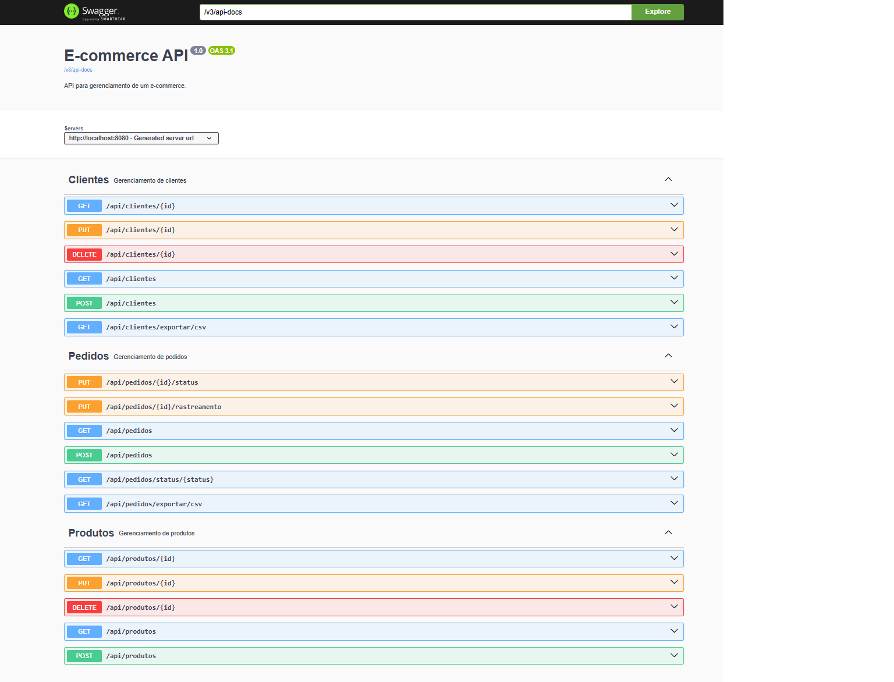

---

# E-commerce API




Este é um sistema de gerenciamento de um E-commerce, desenvolvido em **Spring Boot**. A API oferece funcionalidades para gerenciar clientes, pedidos e produtos de forma eficiente. Ela também possui integração com o Swagger para facilitar a visualização e interação com os endpoints.

## Tecnologias Utilizadas

- **Spring Boot**: Framework principal para desenvolvimento da API.
- **Swagger**: Para documentação e testes da API.
- **MySQL**: Banco de dados relacional para armazenar os dados do e-commerce.

## Funcionalidades

### Gerenciamento de Clientes

- **Criar cliente** (`POST /api/clientes`)
- **Atualizar cliente** (`PUT /api/clientes/{id}`)
- **Deletar cliente** (`DELETE /api/clientes/{id}`)
- **Listar clientes** (`GET /api/clientes`)
- **Exportar clientes para CSV** (`GET /api/clientes/exportar/csv`)

### Gerenciamento de Pedidos

- **Criar pedido** (`POST /api/pedidos`)
- **Listar pedidos** (`GET /api/pedidos`)
- **Listar pedidos por status** (`GET /api/pedidos/status/{status}`)
- **Atualizar status do pedido** (`PUT /api/pedidos/{id}/status`)
- **Atualizar rastreamento do pedido** (`PUT /api/pedidos/{id}/rastreamento`)
- **Exportar pedidos para CSV** (`GET /api/pedidos/exportar/csv`)

### Gerenciamento de Produtos

- **Criar produto** (`POST /api/produtos`)
- **Atualizar produto** (`PUT /api/produtos/{id}`)
- **Deletar produto** (`DELETE /api/produtos/{id}`)
- **Listar produtos** (`GET /api/produtos`)

## Validações de Dados

A API implementa validações rigorosas para garantir a integridade e segurança dos dados dos clientes. As seguintes validações são aplicadas:

1. **Validação de E-mail**: Apenas e-mails válidos são aceitos. A API utiliza uma expressão regular para verificar se o formato do e-mail é válido.

2. **Validação de Senha**: As senhas devem ter entre 6 e 8 caracteres e devem conter pelo menos uma letra maiúscula, uma letra minúscula, um número e um caractere especial (como `@`, `#`, `*`, etc.). A senha é criptografada antes de ser salva no banco de dados.

3. **Validação de Nome**: O nome do cliente deve começar com uma letra maiúscula e deve conter pelo menos um sobrenome. O formato da validação exige que a primeira letra de cada nome seja maiúscula, com espaços entre os nomes.

4. **Validação de Telefone**: O telefone é validado para garantir que possua entre 10 e 11 dígitos, considerando o formato com ou sem o código de área.

5. **Validação de CEP**: O CEP é validado para garantir que esteja no formato correto, com 5 dígitos seguidos de um hífen e 3 dígitos adicionais (ex: `12345-678`).

6. **Verificação de Unicidade**: A API verifica se o e-mail e o telefone fornecidos já estão registrados no banco de dados para evitar duplicação de informações.

Essas validações são implementadas na camada de serviço (`ClienteService`) e são aplicadas durante a criação ou atualização de clientes.

## Endpoints

Aqui estão os principais endpoints da API, que podem ser visualizados e testados diretamente no Swagger:

- **Clientes**
    - `GET /api/clientes`
    - `POST /api/clientes`
    - `PUT /api/clientes/{id}`
    - `DELETE /api/clientes/{id}`

- **Pedidos**
    - `GET /api/pedidos`
    - `POST /api/pedidos`
    - `GET /api/pedidos/status/{status}`
    - `PUT /api/pedidos/{id}/status`
    - `PUT /api/pedidos/{id}/rastreamento`
    - `GET /api/pedidos/exportar/csv`

- **Produtos**
    - `GET /api/produtos`
    - `POST /api/produtos`
    - `PUT /api/produtos/{id}`
    - `DELETE /api/produtos/{id}`

## Como Rodar

1. Clone o repositório:
   ```bash
   git clone https://github.com/seu-usuario/ecommerce-api.git
   ```

2. Navegue até o diretório do projeto:
   ```bash
   cd ecommerce-api
   ```

3. Configure as credenciais do banco de dados no arquivo `application.properties`:
   ```properties
   spring.datasource.url=jdbc:mysql://localhost:3306/ecommerce_db
   spring.datasource.username=root
   spring.datasource.password=senha
   ```

4. Execute o projeto com Maven:
   ```bash
   mvn spring-boot:run
   ```

5. A API estará disponível em `http://localhost:8080`.

## Banco de Dados

- O banco de dados é **MySQL** e contém as seguintes tabelas:
    - **clientes**: Informações dos clientes.
    - **produtos**: Dados sobre os produtos disponíveis no e-commerce.
    - **pedidos**: Registra os pedidos realizados pelos clientes.
    - **pedido_produto**: Relaciona os produtos aos pedidos.
    - **status_history**: Histórico de status dos pedidos.

### Exemplo de Tabelas

#### Clientes
| id  | nome             | email               | telefone      | estado   | cidade        | cep       | rua                               | numero | complemento    | senha                              |
| --- | ---------------- | ------------------- | ------------- | -------- | ------------- | --------- | --------------------------------- | ------ | -------------- | ---------------------------------- |


#### Pedidos
| id  | cliente_id | status        | total   | data_pedido              | rua                               | numero | bairro         | cep       | cidade       | estado   | complemento | numero_rastreamento         |
| --- | ---------- | ------------  | ------- | ------------------------ | --------------------------------- | ------ | -------------- | --------- | ------------ | -------- | ----------- | --------------------------- |


#### Produtos
| id  | nome                 | preco   | estoque |
| --- | -------------------- | ------- | ------- |


#### Status History
| id  | data_alteracao         | status    | pedido_id |
| --- | -------------------- | ------- | ------- |


## Swagger UI

A API é documentada usando **Swagger**. Para visualizar a documentação da API e testar os endpoints, acesse a URL:

```
[http://localhost:8080/swagger-ui/index.html#/]
```

## Licença

Não disponível

---
